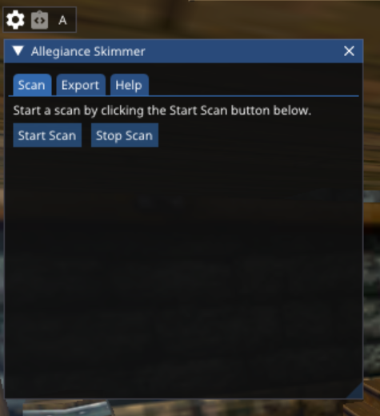
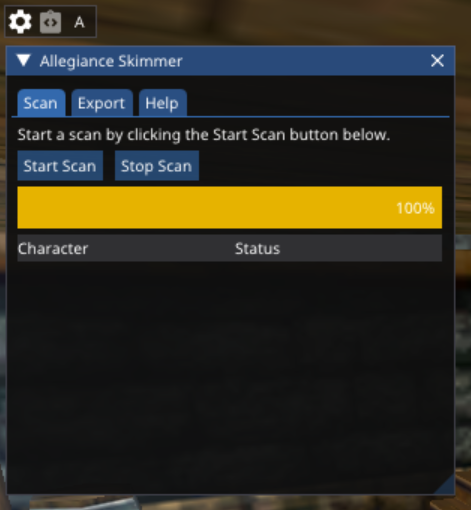
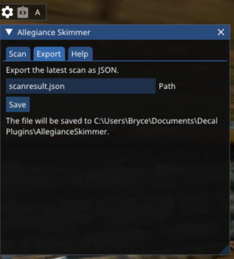

# AllegianceSkimmer

Allegiance scanning Decal plugin for Asheron's Call.
The main use case is mappping out an allegiance for analysis elsewhere.

## Installation

AllegianceSkimmer requires `UtilityBelt.Service`. The installer will automatically install it if needed.

See [Releases](https://github.com/amoeba/AllegianceSkimmer/releases) for a download link to the installer.

## Usage

## Start a Scan

Click "Start Scan" to start scanning your allegiance. As the scan runs, you'll see a progress bar.

## After a Scan

Once the scan is done, you'll should see something like this:

At this point, you still need to export the scan. See the next section.

## Exporting

To export the result of a scan, switch to the Export tab and click "Save".

## Visualizing

The plugin produces a JSON file with the results of the last scan but it doesn't visualize the results for you.
Check out the following options for visualizing the results:

- [VAG-VanguishAllegianceGlancer](https://github.com/Vanquish-6/VAG-VanquishAllegianceGlancer/) by Vanquish420
